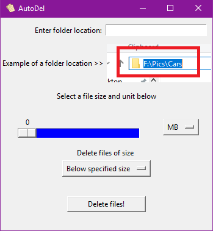
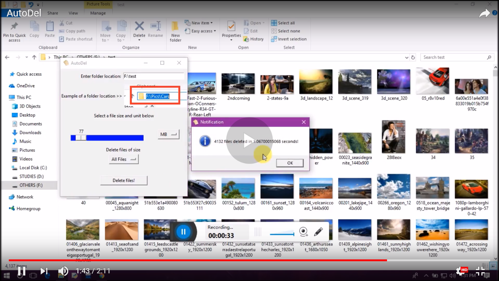
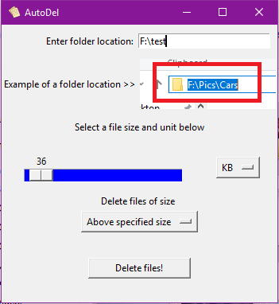
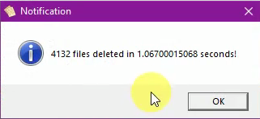

# AutoDel

<b>A desktop app for WINDOWS OS to delete thousands of files in the blink of an eye using `size parameter`<i>(except all the <u>`Read-only`</u> files)</b>

<b><i>It's fast, huh!</i></b>
  

  
  
## <i>View the demo here</i>

## How to use
* clone the repository `$ git clone https://github.com/ab-anand/AutoDel.git`
* `$ cd AutoDel`
* `$ pip install -r requirements.txt`
* `$ python app.py`

## Instructions

### Step 1
* Enter folder location in the format shown in the image. You can simply copy the folder location as shown in image.

### Step 2
* Select a file size and unit i.e., MB, KB, GB if you want a threshold value or simply select `All Files` to delete all files.

### Final step
* Press `Delete Files!` button, soon you'll get a notification like shown below

## <b>To-Do List </b>

- [x] Add cut/copy/paste for filling location.
- [x] Add `ALL FILES` option in dropdown
- [x] Add time measure

<b><i> In case you end up deleting files mistakenly, you can recover it using [RECUVA](https://filehippo.com/download_recuva/)(works for windows only)</i></b>

<b><i> Liked it! Then don't forget to give it a star 🌟 </i></b>

<b><i> Feel like contributing? Check the [Contribution guidelines](CONTRIBUTING.md)</i></b>
